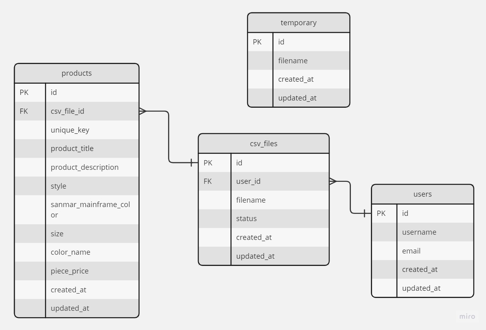

# 
  Welcome to CSV System  

## About CSV Sysytem
Hi there, welcome to the CSV System repository. Here, I provide a simple documentation and details about the system I've created. Enjoy! 💁‍♀️

<video src="https://user-images.githubusercontent.com/92117047/276187203-9e21b901-fec3-42e0-b7fb-0988c484abd1.mp4"></video>

### 📖 Libraries I've used:
- Bootstrap
- jQuery
- AJAX
- CSV League
- Datatables

### 🕹️ WebSocket technology I've used:
- Laravel Event Pusher

### 🎡 Background processing I've used:
- Laravel Database Queue Jobs

### 🔧 Technologies & Tools
Here's tools that I use in this project

### 📁 ERD
I use Miro to design the database, and it's as simple as this.

## 🎮 Let's Start!
1. composer install
2. php artisan key:generate
3. cp .env.example .env
4. php artisan migrate
5. php artisan db:seed
6. composer require pusher/pusher-php-server
7. composer require league/csv
8. composer update
9. php artisan serve

###  A Small Addition
I have implemented a simple user authentication system to provide real-time notifications to another users. You can log in using the username and password created by the seeder.

- user 1 👨‍🦰: username: johndoe, password: 123456
- user 2 👩‍🦰: username: alice, password: 123456

### ➕➕➕✍️🙋‍♀️ PS Notes!
I've created some cool issues that you can check out in the GitHub issue menu. Feel free to follow my journey in building this app through the commit references listed there. Enjoy!